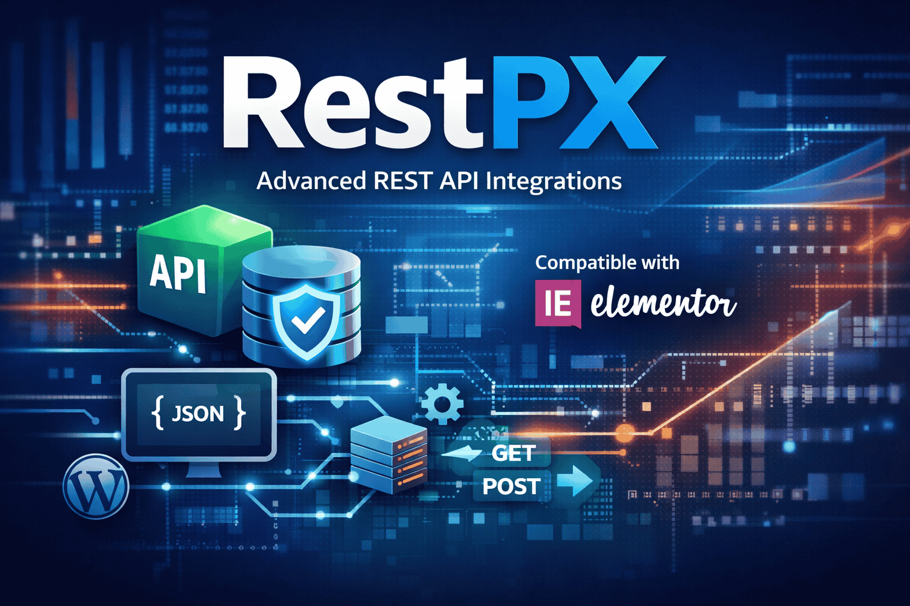

# RestPX - Elementor Add-on

[](https://github.com/prangishviliAbe/RestPX/releases)
[](https://wordpress.org/)
[](https://elementor.com/)

**RestPX** is a powerful WordPress plugin and Elementor add-on that allows you to seamlessly fetch and display posts from external WordPress sites via the REST API. Perfect for aggregating content from multiple sites, creating news portals, or displaying related posts.

## Features

- **Smart URL Parsing**: Automatically detects and handles:
  - **Language Detection**: Supports Polylang prefixes (e.g., `/en/`, `/ka/`) for multilingual sites.
  - **Category Filtering**: Automatically filters posts when a Category URL is provided (e.g., `/category/news/`).
- **Elementor Integration**: Dedicated widget with extensive customization options.
- **Responsive Design**: Beautiful, fully responsive post cards with featured images.
- **Performance Optimized**: Caches API responses to reduce load times and server requests.
- **Flexible Templates**: Multiple card layouts (default, minimal, overlay).
- **Shortcode Support**: Use via shortcode for non-Elementor pages.

## Requirements

- WordPress 5.0 or higher
- Elementor 3.0 or higher
- PHP 7.4 or higher

## Installation

### Method 1: WordPress Admin

1.  Download the plugin ZIP from [GitHub Releases](https://github.com/prangishviliAbe/RestPX/releases).
2.  Go to WordPress Admin > Plugins > Add New > Upload Plugin.
3.  Upload the ZIP file and activate the plugin.

### Method 2: Manual Upload

1.  Upload the plugin files to the `/wp-content/plugins/rest-api-posts` directory.
2.  Activate the plugin through the 'Plugins' screen in WordPress.

## Usage

### Elementor Widget

1.  Edit your page with Elementor.
2.  Drag the **RestPX** widget to your page.
3.  Configure the settings:
    - **API URL**: Enter the URL of the external WordPress site.
      - _Example_: `https://example.com/`
      - _Specific Category_: `https://example.com/category/news/`
      - _Specific Language_: `https://example.com/en/`
    - **Posts Count**: Set the number of posts to display (1-400).
    - **Language**: (Optional) JavaScript language fallback if not present in URL.
    - **Card Template**: Choose from Default, Minimal, or Overlay styles.

### Shortcode

Use the shortcode in any post or page:

```
[restpx api_url="https://example.com" count="5" language="en"]
```

## Changelog

### Version 2.1.0

- **Enhancement**: Increased maximum posts limit from 20 to 400 for better content aggregation capabilities

### Version 2.0.0

- **Major Enhancement**: Added comprehensive styling controls to Elementor widget, matching other Elementor widgets
- **New Features**:
  - Advanced card styling (background colors, borders, shadows, spacing, hover effects)
  - Image customization (height, border radius, borders)
  - Enhanced typography controls for titles, dates, and excerpts
  - Custom arrow uploads for navigation buttons
  - Background options (colors, gradients, images) for the widget container
  - Excerpt display toggle with full styling options
- **UI Improvements**: Expanded style tabs with organized sections for better user experience

### Version 1.9.0

- Enhanced performance with improved caching
- Added new overlay card template
- Better error handling for API requests
- Updated Elementor compatibility

### Version 1.7

- Initial release with basic functionality
- Smart URL parsing for categories and languages
- Elementor widget integration
- Responsive card designs

## Support

For support, bug reports, or feature requests, please [open an issue](https://github.com/prangishviliAbe/RestPX/issues) on GitHub.

## Contributing

Contributions are welcome! Please fork the repository and submit a pull request.

## License

This plugin is licensed under the GPL v2 or later.

## Author

**Abe Prangishvili**

- GitHub: [@prangishviliAbe](https://github.com/prangishviliAbe)
